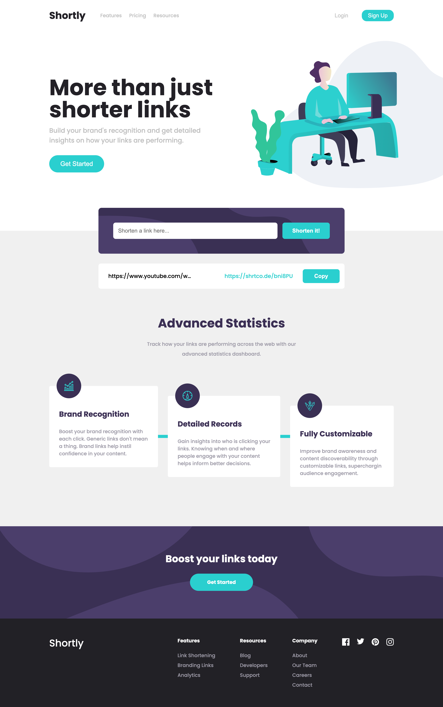

# Frontend Mentor - Shortly URL shortening API Challenge solution

This is a solution to the [Shortly URL shortening API Challenge challenge on Frontend Mentor](https://www.frontendmentor.io/challenges/url-shortening-api-landing-page-2ce3ob-G). Frontend Mentor challenges help you improve your coding skills by building realistic projects. 

## Table of contents

- [Overview](#overview)
  - [The challenge](#the-challenge)
  - [Screenshot](#screenshot)
  - [Links](#links)
- [My process](#my-process)
  - [Built with](#built-with)
  - [What I learned](#what-i-learned)
  - [Continued development](#continued-development)
  - [Useful resources](#useful-resources)
- [Author](#author)

## Overview

### The challenge

Users should be able to:

- View the optimal layout for the site depending on their device's screen size
- Shorten any valid URL
- See a list of their shortened links, even after refreshing the browser
- Copy the shortened link to their clipboard in a single click
- Receive an error message when the `form` is submitted if:
  - The `input` field is empty

### Screenshot

### Links

- Solution URL: [GitHub repo](https://github.com/Vyonyx/URLShorteningAPI-feMentor-Vue)
- Live Site URL: [Hosted on GitHub Pages](https://vyonyx.github.io/URLShorteningAPI-feMentor-Vue/)

## My process

### Built with

- VueJS (Composition API)
- Semantic HTML5 markup
- SCSS
- Flexbox
- CSS Grid
- Mobile-first workflow
- [VueJS](https://nextjs.org/) - Javascript frontend framework
- [ShrtCo.de](https://shrtco.de/docs) - Url shortening API

### What I learned

I could not find a Vue (framework) specific solution to dynamically add and remove a class (for styling). The specific challenge was removing the style class from all buttons within a list and applying the class to the most recently clicked button.

I found myself having to use vanilla JavaScript and DOM manipulation to solve this problem. This experience reassured me that having base knowledge of JavaScript is valuable, no matter what framework I'm working in.

### Continued development

I would like to add delete buttons to the user's list of shortened urls so that they can remove items that are no longer relevant.

## Author

- Website - [Online Portfolio](https://portfolio-vyonyx.vercel.app/)
- Frontend Mentor - [@Vyonyx](https://www.frontendmentor.io/profile/Vyonyx)
